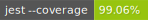

# JavaScript Weather Forecast

One -page educational application "Weather Forecast". Allows you to see the weather forecast for three days in the selected village. Also shows a related map of the terrain. There is a story for the last 10 views.

[Link to the result](https://otus-learning.github.io/otus-learning)

API used:

[Weather API](https://openweathermap.org/api)

[OpenStreetMap Static maps API](https://www.openstreetmap.org)

[OpenStreetMap geocoder API](https://nominatim.openstreetmap.org)

[IP WHOIS](https://ipwho.is)

## Structure:

The project consists of one file of **ui.js**, with the implementation of the logic and user interface + file of used constants **prjConst.js**. There is also a small files with styles and a webpage template (**style.css**, **index.html**).

